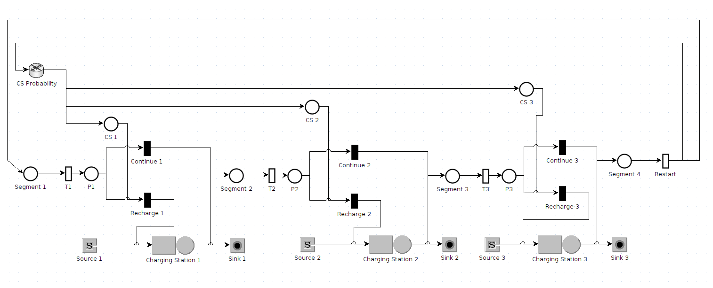

# PEA-project-2024
Progetto del corso "Performance evaluation and applications" dell'anno 2023/2024.

Realizzato usando [Java Modelling Tools (JMT)](https://jmt.sourceforge.net/) e Matlab.

## Schema complessivo

## Project goal
L'obiettivo del progetto è esposto nel pdf nella cartella _"resources/Project_task.pdf"_, mentre la relazione del progetto (contenente la spiegazione dell'implementazione) si trova nel file _"Relazione Progetto PEA.pdf"_
